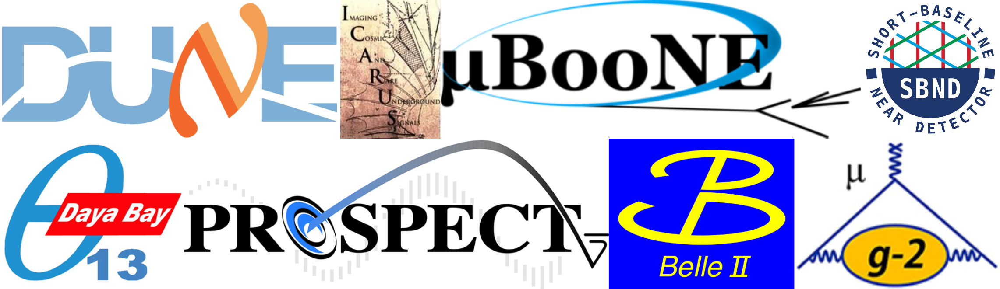

We are an experimental particle physics research group in the [Physics Department](https://www.bnl.gov/physics/) of [Brookhaven National Laboratory](https://www.bnl.gov/). Our mission is to explore properties and interactions of the constituents of matter.

* * *

## Current Experiments

- Deep Underground Neutrino Experiment ([DUNE](https://www.dunescience.org/))
- Short-baseline Neutrino Program ([SBN](https://sbn.fnal.gov/))   
  - [MicroBooNE](http://www-microboone.fnal.gov/)
  - [ICARUS](https://icarus.fnal.gov/)
  - [SBND](https://sbn-nd.fnal.gov/)
- [Belle II](https://www.bnl.gov/belle2/)
- [Daya Bay](https://www.bnl.gov/newsroom/tags/tags.php?tag=daya+bay)
- [PROSPECT](https://prospect.yale.edu/)
- [Muon g-2](http://muon-g-2.fnal.gov/)

## R&D Projects
- Liquid Argon Technology ([LAr@BNL](https://lar.bnl.gov/))
- Water-based Liquid Scintillator

## Software and Computing
- [Wire-Cell](https://lar.bnl.gov/wire-cell/)
- [Machine Learning](https://lar.bnl.gov/ml/)

* * *

## Past Experiments
- MINOS
- [E949](https://www.phy.bnl.gov/e949/)
- [E787](https://www.phy.bnl.gov/e787/e787.html)

